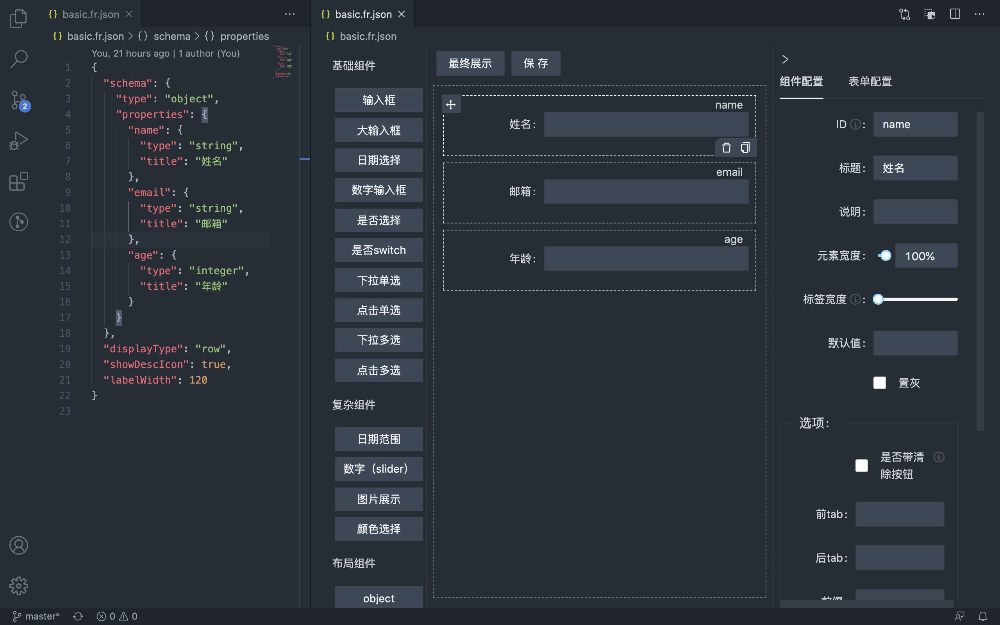

# vscode-plugin-fr-schema

## 安装

* 插件商店搜索 `FormRender` 后安装即可

## 使用

> 可通过 examples 目录下的文件进行测试

* 可视化编辑表单配置
  
  点击 JSON 文件右上角工具栏图标切换编辑模式，默认对以下文件生效

  - *.fr.json
  - *.schema.json
  - schema/*.json
  - schemas/*.json

  或右键任意 JSON 文件，点击 `Open With...` 后选择 `FormRender Schema Editor`

* 表单数据转换为表单配置

  打开 data.json 后按下组合键 `Ctrl+Shift+P`，输入 `formRender` 后选择 `Generate formRender schema from data` 即可自动生成相应的 json schema

* React PropTypes 换为表单配置 ([proptypes-to-json-schema](https://github.com/form-render/proptypes-to-json-schema))

  打开 page.jsx 后按下组合键 `Ctrl+Shift+P`，输入 `formRender` 后选择 `Generate formRender schema from React PropTypes` 即可自动生成相应的 json schema

## 截图



## 开发

* 克隆项目

``` sh
git clone https://github.com/F-loat/vscode-plugin-fr-schema.git
```

* 安装依赖

``` sh
npm install
```

* 调试插件

使用 VSCode 打开项目，执行 `yarn build`，然后按下 F5 开始调试

* 调试页面

开启页面调试配置，并执行 `yarn serve`

``` ts
// src/extension/frSchemaEditor.ts
export class frSchemaEditorProvider implements vscode.CustomTextEditorProvider {
  // ...
  private static readonly isDev = true;
  // ...
}
```
